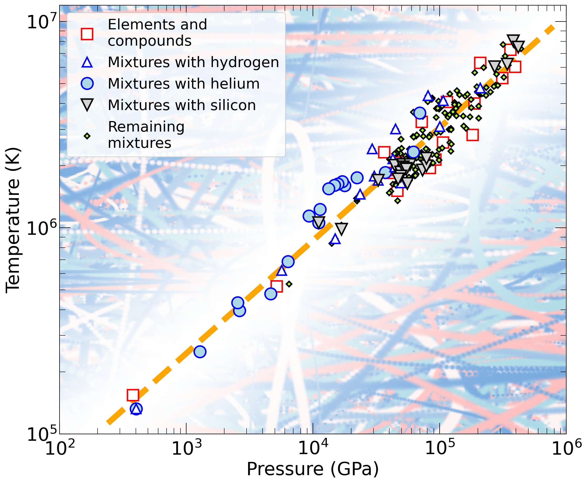

---
jupytext:
  formats: md:myst
  text_representation:
    extension: .md
    format_name: myst
    format_version: 0.13
    jupytext_version: 1.11.5
kernelspec:
  display_name: Python 3
  language: python
  name: python3
---

# FPEOS   
With the goal in mind of making WDM computations more reliable and efficient, we make available our EOS tables for 11 elements and 10 compounds as well as the C++ computer codes for their interpolation. Python code is provided to generate graphs of shock Hugoniot curve, isentropes, isobars, and isotherms for compounds and user-defined mixtures. We put together this first-principles equation of state (FPEOS) database for matter at extreme conditions by combining results from path integral Monte Carlo and density functional molecular dynamics simulations of the elements H, He, B, C, N, O, Ne, Na, Mg, Al and Si as well as the compounds LiF, B4C, BN, CH4, CH2, C2H3, CH, C2H, MgO, and MgSiO3. For all these materials, we provide the pressure and internal energy over a wide density-temperature range from ~0.5 to 50 g/cc and from ~104 to 109 K. This database encompasses the results from approximately 5000 different first-principles simulations. It allows one to compute isobars, adiabats, and shock Hugoniot curves in the regime of L and K shell ionization. Invoking the linear mixing approximation, one can study the properties of user-defined mixtures at high density and temperature.


Download the code <a href="http://militzer.berkeley.edu/FPEOS/" target="_blank">here</a>.





# FPEOS: First-Principles Equation of State Code

## (1) [Download the Latest Version](http://militzer.berkeley.edu/FPEOS/)

| Date       | Description                                                              | Download Link                      |
|------------|---------------------------------------------------------------------------|------------------------------------|
| 05-22-24   | Figures are opened one by one.                                            | `fpeos_05-22-24.tar.gz`            |
| 05-21-24   | Added tutorial file: `FPEOS_tutorial.pdf`                                 | `fpeos_05-21-24.tar.gz`            |
| 05-20-24   | 1. For oxygen, set default `rho0=1.33416818`<br>2. Added `openCommand=...` and `pythonCommand=...`<br>3. `pylab` → `pyplot` | `fpeos_05-20-24.tar.gz` |
| 05-17-24   | Minor updates in Python scripts                                           | `fpeos_05-17-24.tar.gz`            |
| 02-12-22   | Supports ternary mixtures like `C10-H16-O8`                               | `fpeos_02-12-22.tar.gz`            |
| 01-07-21   | First public version of our FPEOS code.                                   | `fpeos_01-07-21.tar.gz`            |

---

## (2) Installation

Download and untar the latest version, change into the directory, and compile:

```bash
tar -xzf fpeos_01-07-21.tar.gz
cd FPEOS
make
```

Expected compilation output:

```text
g++ -O3 -c FPEOS_29.C
g++ -O3 -c EOSTableSimple.C
g++ -O3 -c Parser.C
g++ -O3 -c ReadInTable.C
g++ -O3 -c Standard.C
g++ -O3 -c Form.C
g++ -O3 -c Physics.C
g++ -O3 -c Spline.C
g++ -O3 -c FermiGas.C
g++ -O3 -c RelativisticFermiGas.C
g++ -O3 -c Debye.C
g++ -O3 -c GKIntegration.C
g++ -O3 -c RungeKutta.C
g++ FPEOS_29.o EOSTableSimple.o Parser.o ReadInTable.o Standard.o Form.o Physics.o Spline.o FermiGas.o RelativisticFermiGas.o Debye.o GKIntegration.o RungeKutta.o -lm -o fpeos
```

If compilation fails, try modifying the `Makefile` or using a different compiler.

### Supported Compilers

- Linux: `g++` version 7.5.0, 4.8.4
- macOS: `clang` version 13.0.0, 12.0.0
- Windows: Use Cygwin with `g++` 10.2.1

> Python is required only for plotting. C++ code works without Python.

---

## (3) Files Included

### EOS Tables

Sample filenames:

```
Al_EOS_09-18-20.txt   C10H40_EOS_09-18-20.txt   He_EOS_09-18-20.txt   O_EOS_09-21-20.txt
B4C_EOS_09-18-20.txt  C16H24_EOS_09-18-20.txt   LiF_EOS_09-18-20.txt  Si_EOS_10-19-20.txt
BN_EOS_09-18-20.txt   C18H18_EOS_09-18-20.txt   MgO_EOS_09-18-20.txt
B_EOS_09-18-20.txt    C20H10_EOS_09-18-20.txt   MgSiO3_EOS_09-18-20.txt
C_EOS_09-18-20.txt    H_EOS_09-18-20.txt        N_EOS_09-18-20.txt
```

Sample entry from carbon EOS:

```
f= C N= 1 rho[g/cc]= 0.100006 V[A^3]= 199.43071700 T[K]=  5000 P[GPa]= 0.053 0.007 E[Ha]= -37.66843800 0.00054900
```

Column description:

1. Chemical formula (e.g., C, MgSiO₃)
2. Number of atoms, N
3. Density [g/cm³]
4. Volume of N atoms [ų]
5. Temperature [K]
6. Pressure [GPa]
7. 1-sigma pressure error
8. Internal energy per N atoms [Ha]
9. 1-sigma energy error

### C++ Files

Main file: `FPEOS_29.C`  
Other headers and sources include: `Parser.C`, `Form.h`, `Physics.C`, `RungeKutta.C`, `Spline.C`, etc.

### Python Plotting Scripts

Examples:

```
FPEOS_P_T_plot03.py
FPEOS_T_E_Debye_plot03.py
FPEOS_comp_P_plot04.py
FPEOS_mixture_P_T_plot01.py
FPEOS_rho_T_plot03.py
FPEOS_up_us_plot01.py
```

These require:

```python
from matplotlib.pylab import *
import numpy
import sys
import os
```

Compatible with Python 2.7 and 3.7+

---

## (4) Execution

Run:

```bash
./fpeos
```

This will print available EOS options:

```
1: Hydrogen     8: Sodium       15: CH4
2: Helium       9: Magnesium    16: CH2
3: Boron       10: Aluminum     17: CH1.5
4: Carbon      11: Silicon      18: CH
5: Nitrogen    12: LiF          19: CH0.5
6: Oxygen      13: B4C          20: MgO
7: Neon        14: BN           21: MgSiO3
```

### Examples

- `fpeos EOS=2` — helium
- `fpeos binaryMixture EOS1=1 0.92 EOS2=2 0.08` — H + He
- `fpeos binaryMixture EOS1=4 1.0 EOS2=6 2.0 rho0=1.6381 E0=-188.1576` — CO₂
- Normalize per C2H6: `EOS1=15 1.0 EOS2=16 1.0`
- Normalize per CH3: `EOS1=15 0.5 EOS2=16 0.5`
- Normalize per atom: `EOS1=15 0.125 EOS2=16 0.125`

### Optional Flags

- `doNotCallPython`
- `doNotOpenPDFFiles`
- `processAllEOSs`
- `processAllMixturesOfElements`
- `processAllMixtures`
- `hugoniotCompressionMaximum`
- `noLogInterpolation`

---

## (5) Resulting Files

Use `ls -ltr` to see the outputs. Example files for EOS=13:

```
FPEOS_convex_hull.txt
FPEOS_isobars.txt
FPEOS_Hugoniot.txt
FPEOS_T_P_Debye_plot03.pdf
FPEOS_T_P_Debye_plot03.png
FPEOS_T_E_Debye_plot03.pdf
FPEOS_T_E_Debye_plot03.png
FPEOS_P_T_plot03.pdf
FPEOS_P_T_plot03.png
```

- `.txt` files from C++ code
- `.pdf`/`.png` from Python scripts

---

## (6) Remarks

1. Hugoniot curves assume non-bonded initial states unless `rho0` and `E0` are specified.
2. `E0` is in Hartrees per formula unit (FU).
3. Ideal Fermi gas and Debye plasma routines included.
4. C++ code is minimalist, avoiding large libraries.
5. Python scripts are straightforward and produce high-quality plots.

---

## Contact

For feedback or questions, please contact:

**Burkhard Militzer**  
📧 militzer[at]berkeley[dot]edu  
📅 Last updated: **May 20, 2024**

Happy FPEOS computation!

